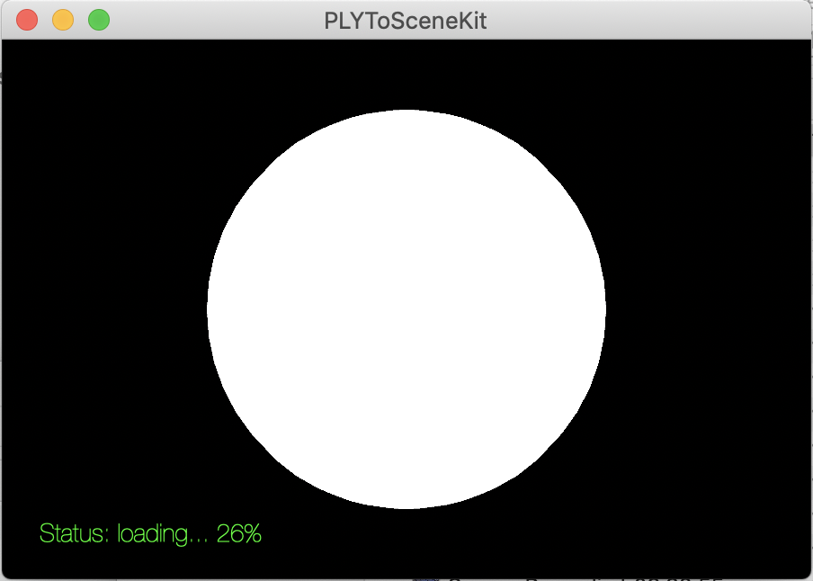

# PointCloud to SceneKit Converter
A very simple utility that converts `ASCII PLY` pointclouds to SceneKit files.

## Converting Files

1. Start the app
2. Click into the window
3. Open PLY file
4. Wait till the file is loaded
5. Save the scene file

